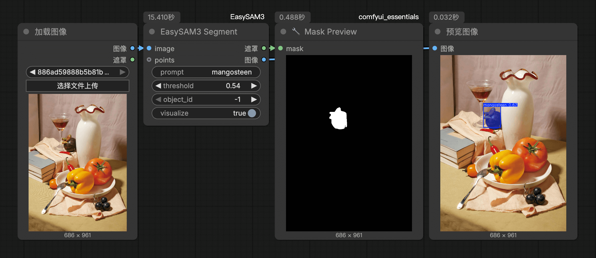

# ComfyUI-EasySAM3  
Easiest way to use SAM3 in ComfyUI (with image/video support)   
**[[📃中文版](./README_zh.md)]**

## Installation  

#### Install the node:  
```bash
cd ComfyUI/custom_nodes
git clone https://github.com/lihaoyun6/ComfyUI-EasySAM3.git
python -m pip install ComfyUI-EasySAM3/requirements.txt
```

## Usage

#### Prediction based on text prompts:  
  

#### Prediction based on control points:  
  

## Credits  
- [ComfyUI](https://github.com/comfyanonymous/ComfyUI) @comfyanonymous  
- [Ultralytics](https://github.com/ultralytics/ultralytics) @ultralytics  
- [SAM3](https://github.com/facebookresearch/sam3) @facebook  
